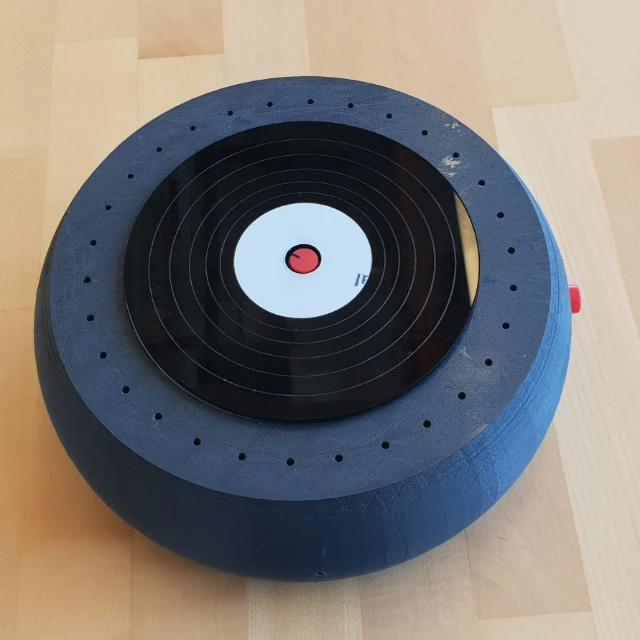
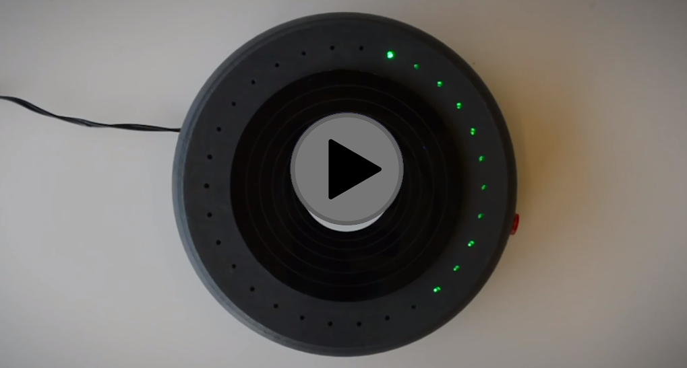

</img>

## What the hell is WeSing?
WeSing is a code that turns your Raspberry Pi into a fun singing toy.
It started (and basically ended) as a group project at the **MiLab 2018-2019** internship , and now is an open-source code for all to use.
It is Python-based and is aimed to work on any Raspberry pi unit.

<kbd>
</img>
</kbd>

_Looks good doesn't it? Thats how WeSing looks full-fledged with our own homemade 3D printed shell_

## Requirements
* a Raspberry-Pi, and the bigger the better. You can run the code on any device really but you will experience a better quality and faster results on a Raspberry-Pi 4.
* a speaker of any kind, but recordings will sound more clear with a good set of headphones.
* a simple microphone. doesn't have to be anything to special.
* a button. any simple button that can be molded/attached to the pi will do.
* a potentiometer.
* Optional: a led strip, for those who enjoy colors and nice lights.

## How it works?

<kbd>
 </img>
</kbd>
